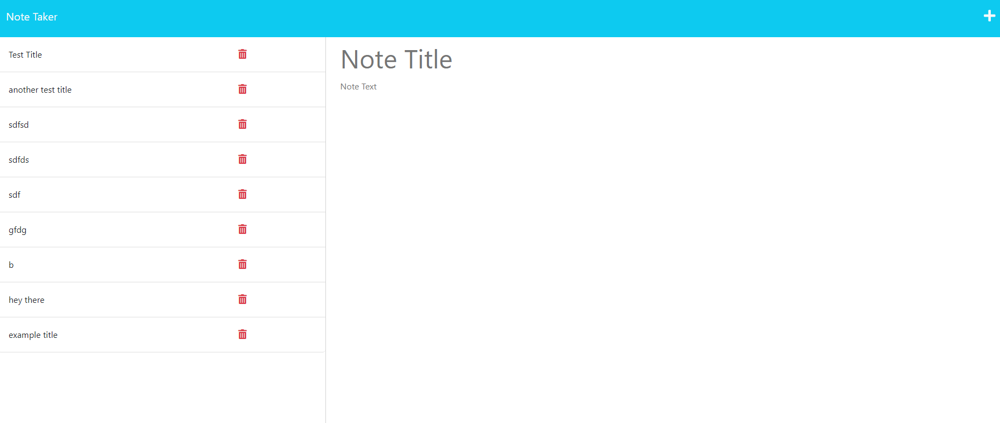

# Module 11 Challenge

## Description

This project is for anyone who would like to keep track of their notes. This application takes the notes that you make and puts them in order so you know which to get done first. It is very helpful to keep track of tasks you need to get done on a daily basis.

## Installation

The only thing required for installation would be typing 'npm i' and 'npm i util' into the terminal. Once those two packages are installed, the application should run smoothly. However with the program deployed on Heroku, those packages may not be neccessary.

## Usage

To use simply type in the note title and text, then click save at the top right corner to add that note to the list of notes.

## Credits

Zach Barnes - https://github.com/TooSparky

## License

No current Licensing
